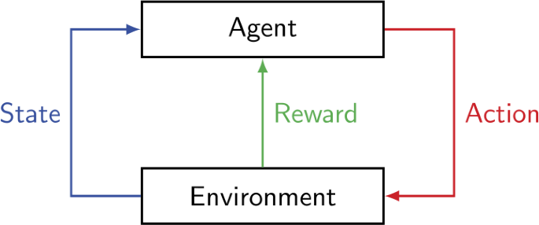
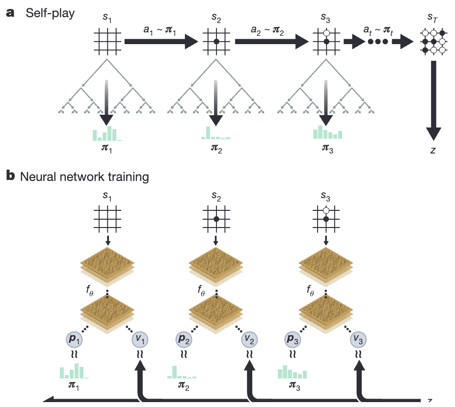
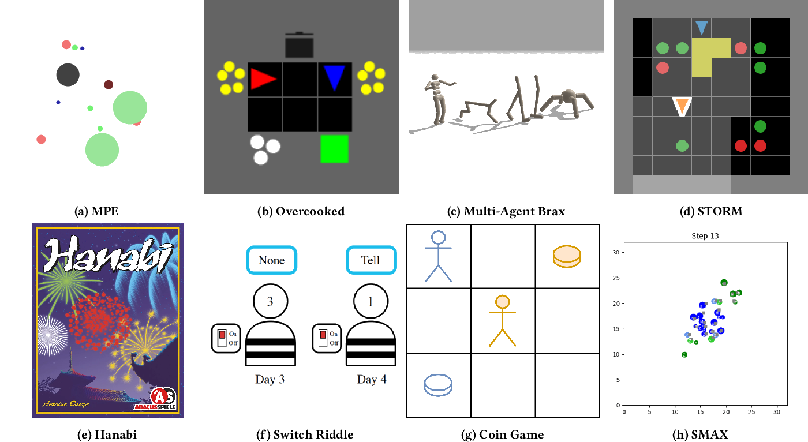

## Introduction to MARL

Multi-Agent Reinforcement Learning (MARL) is an extension of traditional Reinforcement Learning (RL) that deals with multiple agents learning to interact in a shared environment (Buşoniu et al., 2010).

1. **Primer on normal RL**:
   - RL involves an agent learning to make decisions by interacting with an environment.
   - The agent receives rewards or penalties based on its actions and aims to maximize cumulative rewards (Sutton & Barto, 2018).

2. **Why do we need MARL?**:
   - Real-world scenarios often involve multiple decision-makers or agents.
   - MARL allows for modeling complex interactions and dependencies between agents (Zhang et al., 2021).

3. **What necessitates MARL?**:
   - Scenarios with multiple autonomous entities (e.g., robotics, game theory, traffic control).
   - Problems where decentralized decision-making is crucial (Hernandez-Leal et al., 2019).

4. **How does MARL distinguish itself from traditional RL?**:
   - Multiple agents learning simultaneously.
   - Non-stationary environments due to changing behaviors of other agents.
   - Potential for cooperation, competition, or mixed scenarios (Gronauer & Diepold, 2022).

  

    
  

  

    
  

<em>Figure 1: Comparison of Single-Agent RL (left) and Multi-Agent RL Framework (right). Credit: Dinneweth et al. (2022).</em>

## Formalization of MARL

MARL can be formalized as an extension of the Markov Decision Process (MDP) used in single-agent RL. MARL typically uses a Decentralized Partially Observable Markov Decision Process (Dec-POMDP) or a Stochastic Game framework (Oliehoek & Amato, 2016; Shoham & Leyton-Brown, 2008).

1. **Dec-POMDP**:
   A Dec-POMDP is defined by a tuple ($I$, $S$, $A$, $O$, $P$, $R$, $\Omega$, $\gamma$) where:
   - $I$ is the finite set of agents
   - $S$ is the set of states
   - $A = \times_{i \in I} A_i$ is the set of joint actions
   - $O = \times_{i \in I} O_i$ is the set of joint observations
   - $P: S \times A \times S \rightarrow [0, 1]$ is the state transition probability function
   - $R: S \times A \rightarrow \mathbb{R}$ is the reward function
   - $\Omega: S \times A \times O \rightarrow [0, 1]$ is the observation probability function
   - $\gamma \in [0, 1]$ is the discount factor

2. **Stochastic Game**:
   A stochastic game is defined by a tuple ($I$, $S$, $A$, $P$, $R$) where:
   - $I$ is the finite set of agents
   - $S$ is the set of states
   - $A = \times_{i \in I} A_i$ is the set of joint actions
   - $P: S \times A \times S \rightarrow [0, 1]$ is the state transition probability function
   - $R: S \times A \rightarrow \mathbb{R}^{|I|}$ is the reward function, where $R(s, a)$ gives a vector of rewards for each agent
   (Shapley, 1953)

3. **Policy and Value Functions**:
   - Policy: $\pi_i: O_i \rightarrow \Delta(A_i)$, where $\Delta(A_i)$ is the probability distribution over actions
   - Joint Policy: $\boldsymbol{\pi} = (\pi_1, ..., \pi_n)$
   - State-Value Function: $V^{\mathbf{\pi}}(s)$ = $\mathbb{E}\_{\mathbf{\pi}}\left[\sum\_{t=0}^{\infty} \gamma^t R(s\_t, \mathbf{a}\_t) \mid s_0 = s\right]$
   - Action-Value Function: $Q^{\mathbf{\pi}}(s, \mathbf{a}) = \mathbb{E}\_{\mathbf{\pi}}\left[\sum\_{t=0}^{\infty} \gamma^t R(s\_t, \mathbf{a}\_t) \mid s_0 = s, \mathbf{a}\_0 = \mathbf{a}\right]$

4. **Learning Objective**:
   The goal in MARL is to find the optimal joint policy $\boldsymbol{\pi}^*$ (Zhang et al., 2021) that maximizes the expected cumulative reward for all agents:

   $$\boldsymbol{\pi}^* = \arg\max_{\boldsymbol{\pi}} \mathbb{E}_{\boldsymbol{\pi}}[\sum_{t=0}^{\infty} \gamma^t R(s_t, \mathbf{a}_t)]$$
  
## Algorithms

MARL algorithms can be broadly categorized into two types: Online and Offline.

### Online MARL

Agents using Online MARL algorithms learn a policy by directly interacting with the environment and using its experience to improve its behavior. When multiple agents are involved, this means agents must also learn how to interact with other agents (either as teammates, opponents, or a combination of the two). Some examples of Online MARL algorithms are:

#### Value Decomposition Networks (VDN)
   - VDN decomposes the team value function into a sum of individual agent value functions (Sunehag et al., 2018).
   - It assumes that the global Q-function can be additively decomposed into individual agent Q-functions.
   - This approach allows for decentralized execution with centralized training.
   - VDN works by summing the Q-values of individual agent actions and using the total as a Q-value for the entire system:

     $$Q_{tot}(\boldsymbol{\tau}, \mathbf{u}) = \sum_{i=1}^{n} Q_i(\tau_i, u_i)$$

     where $Q_{tot}$ is the total Q-value, $\boldsymbol{\tau}$ is the joint action-observation history (trajectory), $\mathbf{u}$ is the joint action, $n$ is the number of agents, and $Q_i$ is the individual Q-value for agent $i$.

#### QMIX
   - QMIX extends VDN by using a mixing network to combine individual agent Q-values (Rashid et al., 2018).
   - It allows for a more complex relationship between individual and team value functions.
   - QMIX ensures that a global argmax performed on the joint action-value function yields the same result as a set of individual argmax operations performed on each agent's Q-values.
   - The QMIX mixing network combines individual Q-values in a non-linear way:

     $$Q_{tot}(\boldsymbol{\tau}, \mathbf{u}) = f(Q_1(\tau_1, u_1), ..., Q_n(\tau_n, u_n))$$

     where $f$ is a monotonic mixing function implemented as a feed-forward neural network with non-negative weights.

#### Multi-Agent DDPG (MADDPG)
   - MADDPG is an extension of DDPG (Deep Deterministic Policy Gradient) for multi-agent scenarios (Lowe et al., 2017).
   - It uses a centralized training with decentralized execution paradigm.
   - Each agent has its own actor and critic, where the critic has access to all agents' observations and actions during training.
   - MADDPG updates its centralized critic through gradient ascent on the expected return:

     $$\nabla_{\theta_i} J(\theta_i) = \mathbb{E}_{\mathbf{x}, \mathbf{a} \sim \mathcal{D}} [\nabla_{\theta_i} \mu_i(a_i | o_i) \nabla_{a_i} Q_i^{\mu}(\mathbf{x}, \mathbf{a})|_{a_i = \mu_i(o_i)}]$$

     where:
     - $\theta_i$ are the parameters of agent $i$'s policy
     - $J(\theta_i)$ is the expected return for agent $i$
     - $\mu_i$ is the deterministic policy of agent $i$
     - $o_i$ is the observation of agent $i$
     - $\mathbf{x}$ is the state of the environment
     - $\mathbf{a}$ is the joint action of all agents
     - $Q_i^{\mu}$ is the centralized action-value function for agent $i$
     - $\mathcal{D}$ is the replay buffer

#### Multi-Agent PPO (MAPPO)
   - MAPPO is an extension of PPO (Proximal Policy Optimization) for multi-agent scenarios (Yu et al., 2021).
   - It combines the sample efficiency of PPO with centralized training and decentralized execution.
   - MAPPO uses a centralized value function and decentralized policies for each agent.
   - The key idea is to optimize the following objective for each agent $i$ using the following loss function:

     $$L^{CLIP}(\theta_i) = \hat{\mathbb{E}}_t[\min(r_t(\theta_i)\hat{A}_t, \text{clip}(r_t(\theta_i), 1-\epsilon, 1+\epsilon)\hat{A}_t)]$$

     where:
     - $\theta_i$ are the policy parameters for agent $i$
     - $r_t(\theta_i)$ is the probability ratio between the new and old policy
     - $\hat{A}_t$ is the estimated advantage function
     - $\epsilon$ is a hyperparameter that constrains the policy update

   - MAPPO uses a centralized critic to estimate the advantage function, which takes into account the global state and actions of all agents.

### Offline MARL

Conventionally, reinforcement learning algorithms require iterative interaction with the environment to collect information. And using that collected information to improve the policy. These are all characteristic of an **online learning paradigm.** However, in many cases, this type of online interaction is impractical. There are many situations in which data collection in such a paradigm would be expensive or dangerous (e.g., autonomous driving and healthcare). Beyond this, we may be interacting with a complex domain and want to effectively generalize our agents, which requires large datasets. All of these motivate the idea of an **offline learning paradigm.** [Levine 2020]

#### BCQ for Multi-Agent RL (MA-BCQ)
   - MA-BCQ adapts the single-agent Batch Constrained Q-learning (BCQ) to multi-agent settings (Yang et al., 2021).
   - It addresses the extrapolation error in offline RL by constraining the learned policy to be close to the behavior policy in the dataset.
   - MA-BCQ extends the BCQ algorithm to handle multiple agents by introducing a centralized critic and decentralized actors.
   - The algorithm uses a perturbation model to generate actions close to those in the offline dataset, reducing the risk of out-of-distribution actions.
   - MA-BCQ employs a two-stage learning process:
     1. Train a generative model to capture the behavior policy distribution.
     2. Learn a Q-function that evaluates state-action pairs while constraining actions to be similar to those in the dataset.
   - This formulation helps balance between maximizing the Q-value and staying close to the behavior policy, which is crucial for offline learning in multi-agent settings.

Briefly, we can look at what the single-agent BCQ algorithm policy [Fujimoto 2019] looks like for a visual to get intuition about the multi-agent case: 

$$\pi(s) = \text{arg max}_{a_i+\xi_\phi(s, a_i, \Phi)} Q_\theta(s, a_i+\xi_\phi(s, a_i, \Phi)), \{a_i \sim G_\omega(s)\}_{i=1}^n$$

We can understand this by seeing that: 
* $G_\omega$ is the generative model 
* $Q_\theta$ is the value function 
* $\xi_\phi(s, a_i, \Phi)$ is the perturbation model which outputs an adjustment to an action a in the range $[-\Phi, \Phi]$. This is used to improve the diversity of the seen actions, while staying close to distribution. 

This is extended as discussed above into the multi-agent scenario. 

However, Yang et. al. 2021 notes that while BCQ works well in single-agent scenarios, the unseen state-action pairs grow exponentially as the number of agent increases and so the extrapolation error accumulates and grows very quickly resulting in poor performance by BCQ in multi-agent settings. And as a result, they propose a newer algorithm ICQ (which we will not explore in this post). 

#### Multi-Agent Constrained Policy Optimization (MACPO) 

At a high-level multi-agent constraiend policy optimization (MACPO) extends the single agent concept of constrained policy optimization (CPO) to multi-agent scenarios. This algorithm is motivated by the drive to develop safe policies for multi-agent systems. This can often be difficult because the individual agent has to consider both it's own safety constraints, but also the constraints of others so that collectively the joint behavior is guaranteed to be safe. [Gu 2021]

To formulate the problem, we first define the general framework that will be used for this discussion. A safe MARL problem can be thought of as a constrained Markov game $\langle\mathcal{N}, \mathcal{S}, \mathbf{\mathcal{A}}, p, \rho^0, \gamma, R, \mathbf{C}, \mathbf{c}\rangle$. 
* $\mathcal{N} = \{1,\ldots,n\}$ is the set of agents
* $\mathcal{S}$ is the state space
* $\mathbf{\mathcal{A}} = \Pi_{i=1}^n \mathcal{A}^i$ is the product of the agents' action spaces (joint action space)
* $p : S \times \mathbf{\mathcal{A}} \times S \rightarrow \mathbb{R}$ is the joint reward function
* $\rho^0$ is the initial state distribution
* $\gamma \in [0, 1)$ is the discount factor
* $R: \mathcal{S} \times \mathbf{\mathcal{A}} \rightarrow \mathbb{R}$ is the joint reward function 
* $\mathbf{C} = \{C_j^i\}_{i \le j \le m^i}^{i \in \mathcal{N}}$ is the set of sets of cost functions, where every agent $i$ has $m^i$ cost functions of the form $C_j^i : \mathcal{S} \times \mathcal{A}^i \rightarrow \mathbb{R}$
* $\mathbf{c} = \{c_j^i\}_{i \le j \le m^i}^{i \in \mathcal{N}}$ is the set of corresponding cost-constrainign values for the above cost functions. 

Note: that in this work (Gu, 2021), the authors consider a fully-cooperative setting meaning all agents share the same reward function. 

With the background of the MDP established, let us look at the formulation of the problem. The algorithm builds upon the concept of multi-agent trust region learning and constrained policy optimization to solve these above presented constrained Markov games. 
* **Trust-Region Learning** [Schulman 2015] refers to the concept of optimizing the function by maintaining small movements to allow the agent to interact within a region that has been deemed "safe." Additionally, this allows to simplify the theoretical algorithm to a more manageable, practical algorithm within this trust region. That is, we are able to optimize a surrogate function rather than the original more complicated function. 
* **Constrained Policy Optimization** [Achiam 2017] is a technique that guarantees constraint satisfaction throughout the training of a model and works for arbitrary policy classes (e.g. including neural networks).

With the above single-agent concepts satisfied, the authors are able to show that the joint policies in a MACPO algorithm will have a monotonic imporvement property (that is the reward performance monotonically increases and improves) and the policies satisfy the safety constraints. 

This can all be summarized by the central equation from Gu 2021: 

$$J_j^i(\overline{\pi}) \le J_j^i(\pi) + L_{j,\pi}^i(\overline{\pi}^i) + \nu_j^i\Sigma_{h=1}^nD_{KL}^{max}(\pi^h, \overline{\pi}^h)$$

While this looks complicated, we can break it down and think about it like this: 
* $\pi$ and $\overline{\pi}$ are joint policies, with $\overline{\pi}$ being the "new" policy. 
* $J_j^i(\overline{\pi}) - J_j^i(\pi)$ is the change in the $j$th cost of the agent $i$
* $L_{j,\pi}^i(\overline{\pi}^i)$ is the surrogate return function.
* As long as the distance between these two values is sufficiently small, then the change in the cost of the agent is controlled only by the surrogate.

The algorithm then works by sequentially updating each of these policies as we are guaranteed the above assumptions will hold. So, this turns into a similar situation the constrained policy optimization, but with sequential updates for each of the agents involved. 

Thus, to summarize, the authors created a new algorithm MACPO, which showcased the following: 
- formulate this MARL problem as a safe MARL problem in a constrained Markov game 
- they solved it using a policy optimization method which leveraged the constraiend policy optimization and multi-agent trust region learning concepts. 
- and they are able to provide theoreticl guarantees of monotonic improvement in reward and continual satisfaction of safety constraints at every iteration 

#### Challenges with Offline MARL
While offline MARL proposes the ideas that will be beneficial in multi-agent settings, the reality is that they at the moment it faces challenges and falls short in several ways. 
1. **Data Collection** - Collecting static data is a significant challenge. This has a huge time cost, requires expertise, etc. It often requires human experts to manually comb through the data checking for relevance and accuracy. [Oh 2024]
2. **Model Generalization** - Due to this expensive data collection procedure, we often have datasets that are lacking in variability and complexity. These are both characteristic sof real-world scenarios. And since our data is so limited, offline MARL algorithms may not be exposed to the range of full experiences they ned to be robustly trained. This may lead to overfitting to the training data nd poor generalization. [Oh 2024]

## Applications of MARL

MARL has found applications in many different areas due to the power and flexibility inherent to modelling complex real-world interactions.

1. **Stackelberg Security Games**:
   - A leader (defender) and followers (attackers) in a sequential game.
   - Modelling and solve security resource allocation problems is a natural use-case for MARL.
   - Example: Bandyopadhyay et al. (2022) used MARL to model deforestation patterns in Indonesia.

2. **Game Theory and Strategy Games**:
   - MARL has been successfully applied to complex strategy games like Go, Chess, and Poker.
   - Example: DeepMind's AlphaGo Zero used self-play, a form of multi-agent learning, to achieve superhuman performance in Go (Silver et al., 2017).

3. **Financial Markets**:
   - Algorithmic trading and portfolio management often involves many agents making decisions.
   - It can model complex market dynamics and interactions between multiple traders.
   - Example: Shevandi & Khedmati (2022) used MARL for developing adaptive trading strategies in simulated financial markets.

4. **Network Security**:
   - Adaptive cybersecurity systems often model multiple agents.
   - They can model the interactions between attackers and defenders in network security scenarios.
   - Example: Wilson et al. (2024) applied MARL to simulate and counter various types of network attacks.

5. **Supply Chain Management**:
   - Optimizing complex supply chains with multiple stakeholders modeled as agents.
   - It can handle inventory management, logistics, and demand forecasting in a coordinated manner.
   - Example: Jiang et al. (2009) used MARL for adaptive inventory management.

  
  
<em>Figure 2: AlphaGo Zero, developed by DeepMind, uses self-play, a MARL technique. Credit: Silver et. al. (2017).</em>

### Robotics

MARL has found numerous applications in robotics, leveraging the power of collaborative learning and decision-making. MARL is quite important in decision-making for robotics as most scenarios that we think of modeling in the world require the interaction between multiple subjects/agents. If we would like to deploy robots into the world successfully, we need to make sure they are capable of making the right decision and acting properly in the multi-agent ecosystem.

1. **Swarm Robotics**:
   - MARL enables large groups of simple robots to exhibit complex collective behaviors.
   - Search and rescue operations, environmental monitoring, and collective construction tasks are all applicable areas.
   - Example: Hüttenrauch et al. (2019) used MARL to train a swarm of robots for cooperative object transportation.

2. **Autonomous Vehicles**:
   - MARL also helps in coordinating multiple autonomous vehicles for traffic management and collision avoidance.
   - It's used in developing adaptive traffic light control systems and optimizing fleet management.
   - Example: Zhou et al. (2021) applied MARL for simulating autonomous vehicles interactions.

3. **Robotic Manipulation**:
   - Multiple robotic arms can collaborate on complex manipulation tasks using MARL.
   - Applications include assembly lines, warehouse automation, and surgical robotics.
   - Example: Gu et al. (2017) used MARL to train multiple robotic arms for collaborative object manipulation tasks.

4. **Drone Coordination**:
   - MARL algorithms help in coordinating multiple drones for tasks like area coverage, surveillance, and package delivery.
   - It's particularly useful in scenarios requiring dynamic task allocation and collision avoidance.
   - Example: Qie et al. (2019) applied MARL for coordinating multiple UAVs in search and rescue missions.

5. **Human-Robot Interaction**:
   - Robots that can effectively collaborate with humans in shared workspaces often use MARL.
   - Applications include assistive robotics, collaborative manufacturing, and service robots.
   - Example: Nikolaidis et al. (2017) used MARL to enable robots to adapt their behavior based on human preferences in collaborative tasks.

## Open Research Questions in MARL

Despite significant progress in MARL, several open research questions remain. These challenges present many opportunities for further advancement in the field:

1. **Scalability**:
   - How can MARL algorithms be scaled to handle a large number of agents efficiently?
   - What techniques can be developed to reduce the computational complexity as the number of agents increases?

2. **Non-stationarity**:
   - How can MARL algorithms better address the non-stationary nature of multi-agent environments?
   - What methods can improve stability and convergence in the face of changing agent behaviors?

3. **Credit Assignment**:
   - How can we accurately attribute team success or failure to individual agent actions in cooperative settings?
   - What techniques can be developed to solve the multi-agent credit assignment problem more effectively?

4. **Explainable MARL**:
   - How can we make MARL algorithms more interpretable and explainable?
   - What techniques can be developed to provide insights into the decision-making processes of multiple agents?

5. **Heterogeneous Agent Teams**:
   - How can MARL algorithms be designed to effectively handle teams of agents with different capabilities or objectives?
   - What techniques can be developed to optimize the composition and coordination of heterogeneous agent teams?

6. **Data Quality and Augmentation**
   - What are effective ways to augment offline datasets for offline training paradigms? 
   - How do we do this efficiently and reduce the cost to gather and generate data that exist today?

Addressing these open questions will lead more robust, efficient, and widely applicable multi-agent systems.

  
  
<em>Figure 3: JAXMARL addresses scalability concerns with JAX accelerated computation. Credit: Rutherford et. al. (2023).</em>

## References

Bandyopadhyay, S., Zhu, C., Daniel, P., Morrison, J., Shay, E., & Dickerson, J. (2022). Targets in Reinforcement Learning to solve Stackelberg Security Games. arXiv preprint arXiv:2211.17132.

Bernstein, D. S., Givan, R., Immerman, N., & Zilberstein, S. (2002). The complexity of decentralized control of Markov decision processes. Mathematics of operations research, 27(4), 819-840.

Buşoniu, L., Babuška, R., & De Schutter, B. (2010). Multi-agent reinforcement learning: An overview. In Innovations in multi-agent systems and applications-1 (pp. 183-221). Springer.

Gronauer, S., & Diepold, K. (2022). Multi-agent deep reinforcement learning: a survey. Artificial Intelligence Review, 55(2), 895-943.

Hernandez-Leal, P., Kartal, B., & Taylor, M. E. (2019). A survey and critique of multiagent deep reinforcement learning. Autonomous Agents and Multi-Agent Systems, 33(6), 750-797.

Lowe, R., Wu, Y., Tamar, A., Harb, J., Abbeel, P., & Mordatch, I. (2017). Multi-agent actor-critic for mixed cooperative-competitive environments. In Advances in neural information processing systems (pp. 6379-6390).

Oliehoek, F. A., & Amato, C. (2016). A concise introduction to decentralized POMDPs. Springer.

Rashid, T., Samvelyan, M., Schroeder, C., Farquhar, G., Foerster, J., & Whiteson, S. (2018). QMIX: Monotonic value function factorisation for deep multi-agent reinforcement learning. In International Conference on Machine Learning (pp. 4295-4304). PMLR.

Shapley, L. S. (1953). Stochastic games. Proceedings of the national academy of sciences, 39(10), 1095-1100.

Shoham, Y., & Leyton-Brown, K. (2008). Multiagent systems: Algorithmic, game-theoretic, and logical foundations. Cambridge University Press.

Sunehag, P., Lever, G., Gruslys, A., Czarnecki, W. M., Zambaldi, V., Jaderberg, M., ... & Graepel, T. (2018). Value-decomposition networks for cooperative multi-agent learning based on team reward. In Proceedings of the 17th International Conference on Autonomous Agents and MultiAgent Systems (pp. 2085-2087).

Sutton, R. S., & Barto, A. G. (2018). Reinforcement learning: An introduction. MIT press.

Lee, B., Lee, J., Vrancx, P., Kim, D., & Kim, K. E. (2020, November). Batch reinforcement learning with hyperparameter gradients. In International Conference on Machine Learning (pp. 5725-5735). PMLR.

Yang, Y., Ma, X., Li, C., Zheng, Z., Zhang, Q., Huang, G., ... & Zhao, Q. (2021). Believe what you see: Implicit constraint approach for offline multi-agent reinforcement learning. Advances in Neural Information Processing Systems, 34, 10299-10312.

Yu, C., Velu, A., Vinitsky, E., Wang, Y., Bayen, A., & Wu, Y. (2021). The surprising effectiveness of PPO in cooperative, multi-agent games. arXiv preprint arXiv:2103.01955.

Zhang, K., Yang, Z., & Başar, T. (2021). Multi-agent reinforcement learning: A selective overview of theories and algorithms. Handbook of Reinforcement Learning and Control, 321-384.

Hüttenrauch, M., Šošić, A., & Neumann, G. (2019). Deep reinforcement learning for swarm systems. Journal of Machine Learning Research, 20(54), 1-31.

Zhou, M., Luo, J., Villella, J., Yang, Y., Rusu, D., Miao, J., ... & Wang, J. (2021, October). Smarts: An open-source scalable multi-agent rl training school for autonomous driving. In Conference on robot learning (pp. 264-285). PMLR.

Gu, S., Holly, E., Lillicrap, T., & Levine, S. (2017, May). Deep reinforcement learning for robotic manipulation with asynchronous off-policy updates. In 2017 IEEE international conference on robotics and automation (ICRA) (pp. 3389-3396). IEEE.

Qie, H., Shi, D., Shen, T., Xu, X., Li, Y., & Wang, L. (2019). Joint optimization of multi-UAV target assignment and path planning based on multi-agent reinforcement learning. IEEE access, 7, 146264-146272.

Nikolaidis, S., Hsu, D., & Srinivasa, S. (2017). Human-robot mutual adaptation in collaborative tasks: Models and experiments. The International Journal of Robotics Research, 36(5-7), 618-634.

Levine, S., Kumar, A., Tucker, G., & Fu, J. (2020). Offline reinforcement learning: Tutorial, review, and perspectives on open problems. arXiv preprint arXiv:2005.01643.

Gu, S., Kuba, J. G., Wen, M., Chen, R., Wang, Z., Tian, Z., ... & Yang, Y. (2021). Multi-agent constrained policy optimisation. arXiv preprint arXiv:2110.02793.

Schulman, J. (2015). Trust Region Policy Optimization. arXiv preprint arXiv:1502.05477.

Achiam, J., Held, D., Tamar, A., & Abbeel, P. (2017, July). Constrained policy optimization. In International conference on machine learning (pp. 22-31). PMLR.

Rutherford, A., Ellis, B., Gallici, M., Cook, J., Lupu, A., Ingvarsson, G., ... & Foerster, J. N. (2023). Jaxmarl: Multi-agent rl environments in jax. arXiv preprint arXiv:2311.10090.

Jiang, J., & Lu, Z. (2023). Offline Decentralized Multi-Agent Reinforcement Learning. In ECAI (pp. 1148-1155).

Silver, D., Schrittwieser, J., Simonyan, K., Antonoglou, I., Huang, A., Guez, A., ... & Hassabis, D. (2017). Mastering the game of go without human knowledge. nature, 550(7676), 354-359.

Shavandi, A., & Khedmati, M. (2022). A multi-agent deep reinforcement learning framework for algorithmic trading in financial markets. Expert Systems with Applications, 208, 118124.

Wilson, A., Menzies, R., Morarji, N., Foster, D., Mont, M. C., Turkbeyler, E., & Gralewski, L. (2024). Multi-Agent Reinforcement Learning for Maritime Operational Technology Cyber Security. arXiv preprint arXiv:2401.10149.

Jiang, C., & Sheng, Z. (2009). Case-based reinforcement learning for dynamic inventory control in a multi-agent supply-chain system. Expert Systems with Applications, 36(3), 6520-6526.

Scott Fujimoto, David Meger, and Doina Precup. Off-policy deep reinforce- ment learning without exploration, 2019.

Jihwan Oh, Sungnyun Kim, Gahee Kim, SeongHwan Kim, and Se-Young Yun. Diffusion-based episodes augmentation for offline multi-agent rein- forcement learning. In ICML 2024 Workshop on Structured Probabilistic Inference & Generative Modeling, 2024.

Dinneweth, J., Boubezoul, A., Mandiau, R., & Espié, S. (2022). Multi-agent reinforcement learning for autonomous vehicles: A survey. Autonomous Intelligent Systems, 2(1), 27.
